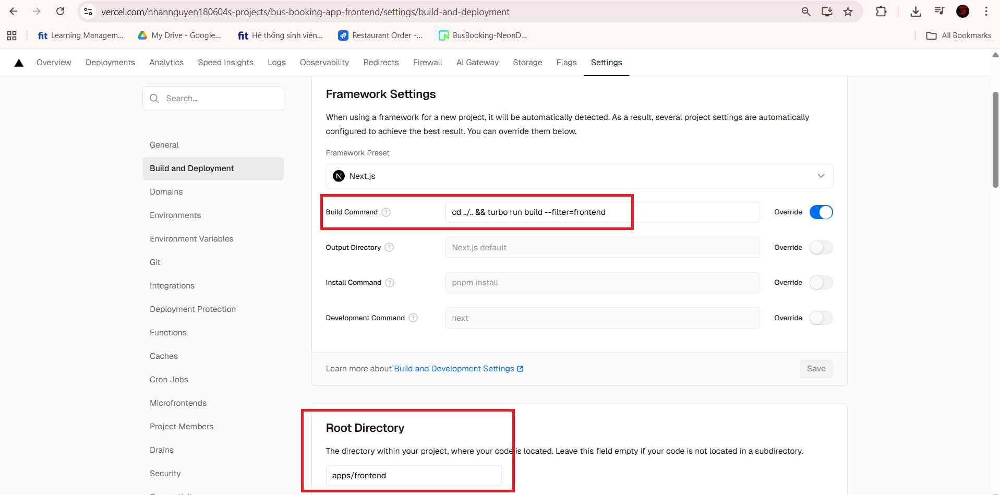
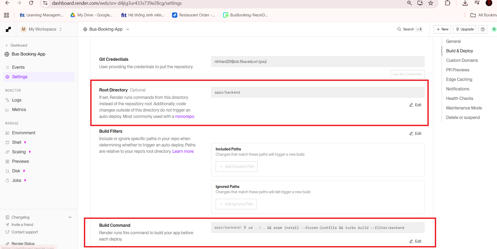
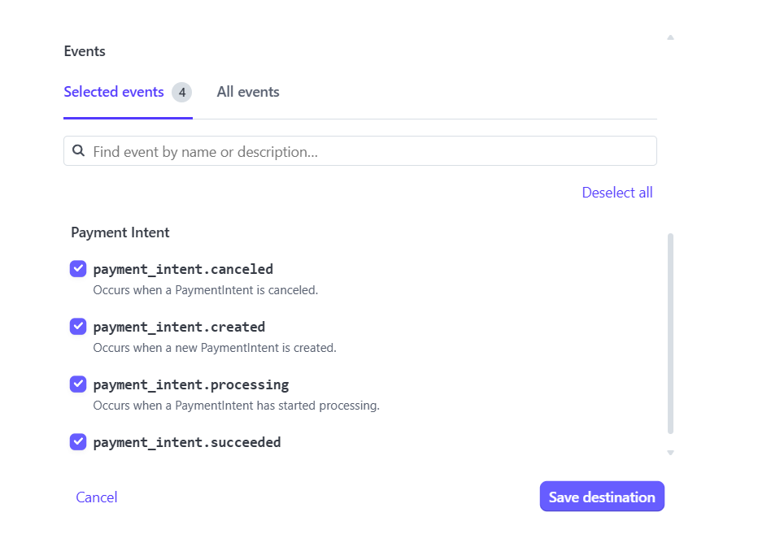

# Frontend Deployment

We deploy our Frontend on **Vercel**.

1. Import the project to [Vercel](https://vercel.com/new)
2. Set the **root directory** to `apps/frontend`
3. Set the **build command** as follows:
   ```
   cd ../.. && turbo run build --filter=frontend
   ```


4. Import or manually type the **environment variables**  
5. Deploy

# Backend Deployment

We deploy our backend on **render.com**.

1. Import the project to [render](https://render.com)
2. Set the **root directory** to `apps/backend`
3. Set the **build command** as follows:
   ```
   cd ../.. && pnpm install --frozen-lockfile && turbo build --filter=backend
   ```


4. Deploy

# Stripe Webhook

1. Get the **deployed Backend's URL**
2. Append `"/webhooks/stripe"` to it and set it as a **listener in Stripe dashboard**
3. Select **at least these 4 events** to listen to:


4. Get the **webhook secret**
5. Put it as an **environment variable** for the deployed Backend

# Final Steps

1. Get the **deployed Frontend URL**, put it as an **environment variable** for the deployed Backend
2. Get the **deployed Backend URL**, put it as an **environment variable** for the deployed Frontend

# Deployed URLs

- **Frontend:** https://bus-booking-app-frontend.vercel.app/
- **Backend:** https://bus-booking-app-frontend.vercel.app/
